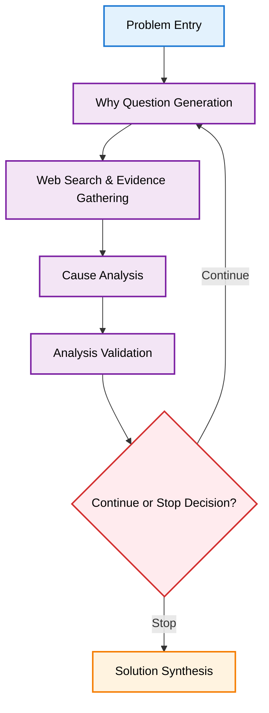

# Building a Five Whys Agent with LangGraph: Lessons in Structured AI Reasoning

## Introduction

Imagine you're facing a complex problem that needs solving—whether it's a business process that's broken, a product feature that's not working as expected, or a team dynamic that's causing friction. You know the Five Whys methodology should help you dig deeper than surface-level symptoms, but in the heat of the moment, it's easy to skip steps, make assumptions, or stop too early. What if you had an AI agent that could systematically guide you through this analysis, ensuring you don't miss critical insights?

This is exactly the challenge we set out to solve: automating systematic problem-solving workflows that humans struggle to execute consistently under pressure. The Five Whys methodology—asking "why" five times to drill down to root causes—is a powerful tool for root cause analysis, but it's notoriously difficult to implement properly. Manual analysis often suffers from cognitive biases, inconsistent application, and the natural tendency to stop at the first plausible explanation rather than digging deeper.

The problem is clear: manual Five Whys analysis is time-consuming, requires significant expertise to execute well, and produces inconsistent results. Teams either stop too early, missing the true root cause, or get lost in circular reasoning without clear stopping criteria. In high-stakes situations like business decisions, product launches, or customer escalations, this inconsistency can mean the difference between a quick resolution and hours of wasted effort.

Our solution is an AI agent built with LangGraph that automates the Five Whys process using structured reasoning. This agent doesn't just ask questions—it systematically validates each step, gathers evidence through web searches, and makes intelligent decisions about when to continue digging versus when to synthesize solutions. By combining the systematic approach of Five Whys with the consistency and scalability of AI, we've created a tool that can transform how teams approach complex problem-solving.

## High-Level Architecture Overview

### System Architecture Diagram

At the heart of our Five Whys agent is a LangGraph workflow that orchestrates a series of specialized nodes, each responsible for a specific aspect of the analysis. Here's how the system flows:



The workflow follows this pattern:
1. **Problem Entry**: User provides the initial problem description
2. **Why Question Generation**: AI generates the next "why" question based on current analysis
3. **Web Search & Evidence Gathering**: External data is collected to support the analysis
4. **Cause Analysis**: The AI analyzes the evidence and identifies potential causes
5. **Analysis Validation**: Each step is scored for quality and relevance
6. **Continue or Stop Decision**: The system decides whether to dig deeper or synthesize solutions
7. **Solution Synthesis**: Final recommendations are generated based on the complete analysis

**Key Insight**: The decision node creates a feedback loop back to "Why Question Generation" when continuing the analysis. This loop continues until the validation scores indicate sufficient depth has been reached, preventing both premature stopping and infinite circular reasoning.

This architecture ensures that each step builds upon the previous one, with validation at every stage to maintain quality and prevent circular reasoning.

### Core Components

The Five Whys agent is built on four foundational components that work together to create a robust, maintainable system:

#### 1. State Management with TypedDict

At the core of our system is a carefully designed state structure using Python's `TypedDict`. This approach provides type safety while maintaining the flexibility needed for dynamic AI workflows:

```python
class FiveWhysState(TypedDict):
    # Core problem tracking
    original_problem: str
    current_analysis_depth: int
    max_depth: int
    
    # Why chain progression
    why_questions: List[str]
    cause_analyses: List[CauseAnalysis]
    evidence_sources: List[EvidenceSource]
    
    # Quality metrics and validation
    validation_scores: List[ValidationScore]
    overall_confidence: float
    
    # Solution generation tracking
    root_causes: List[str]
    proposed_solutions: List[Solution]
    final_recommendations: Optional[Recommendations]
```

This state structure serves as the single source of truth throughout the analysis, ensuring that each node has access to the complete context while maintaining type safety and IDE support.

#### 2. Structured Output Validation with Pydantic

Every AI-generated output is validated using Pydantic models, ensuring consistency and preventing downstream errors:

```python
class CauseAnalysis(BaseModel):
    cause_description: str
    confidence_score: float = Field(ge=0.0, le=1.0)
    supporting_evidence: List[str]
    potential_contradictions: List[str]
    
class ValidationScore(BaseModel):
    relevance_score: float = Field(ge=0.0, le=1.0)
    depth_score: float = Field(ge=0.0, le=1.0)
    evidence_quality: float = Field(ge=0.0, le=1.0)
    should_continue: bool
```

This validation layer catches inconsistencies early, provides clear error messages, and ensures that the AI's outputs meet our quality standards before proceeding to the next step.

#### 3. Modular Node Design

Each analysis step is implemented as a focused, testable node with a single responsibility:

- **`generate_why_question`**: Creates contextually appropriate follow-up questions
- **`gather_evidence`**: Performs web searches and collects supporting data
- **`analyze_cause`**: Processes evidence to identify potential causes
- **`validate_analysis`**: Scores the quality and relevance of each step
- **`decide_continuation`**: Determines whether to continue or synthesize solutions
- **`synthesize_solutions`**: Generates final recommendations

This modular approach makes the system easier to test, debug, and extend. Each node can be developed and validated independently, reducing complexity and improving maintainability.

#### 4. Conditional Routing Based on Validation Results

The system's intelligence lies in its decision-making logic. Rather than following a fixed sequence, the agent dynamically routes based on validation scores:

```python
def should_continue_analysis(state: FiveWhysState) -> str:
    latest_validation = state["validation_scores"][-1]
    current_depth = state["current_analysis_depth"]
    max_depth = state["max_depth"]
    
    # Stop if we've reached the maximum number of whys
    if current_depth >= max_depth:
        return "synthesize_solutions"
    
    # Stop if we've reached sufficient depth based on quality
    if latest_validation.depth_score > 0.8:
        return "synthesize_solutions"
    
    # Stop if we're going in circles or losing relevance
    if latest_validation.relevance_score < 0.3:
        return "synthesize_solutions"
    
    # Continue if we need more depth and haven't hit limits
    return "generate_why_question"
```

This conditional routing ensures that the analysis continues only when it's adding value, preventing both premature stopping and infinite loops.

### Key Design Principles

The architecture of our Five Whys agent is built on several key design principles that ensure maintainability, reliability, and extensibility:

#### 1. Separation of Concerns

We've carefully separated different aspects of the system into distinct, focused modules:

- **State Management**: All data flows through the centralized `FiveWhysState`
- **Business Logic**: Each node contains only the logic for its specific responsibility
- **Prompt Engineering**: Prompts are stored separately and can be easily modified without touching code
- **Configuration**: Agent behavior is controlled through external configuration files

This separation makes the system easier to test, debug, and modify. For example, you can improve the quality of "why" questions by refining prompts without changing any business logic.

#### 2. Consistency Through Structured Outputs

Just as SQL prepared statements prevent injection attacks and ensure data integrity, structured outputs in AI systems prevent inconsistencies and ensure reliable data flow. Every AI interaction produces validated outputs using Pydantic models, which provides several critical benefits:

- **Predictable Processing**: All outputs follow the same format, making downstream processing reliable
- **Early Error Detection**: Invalid outputs are caught immediately, preventing cascading failures
- **Clear Debugging**: Structured error messages help identify issues quickly
- **Type Safety**: IDE support and static analysis catch errors before runtime

This approach transforms unpredictable AI text generation into reliable, structured data that can be safely processed by downstream systems.

#### 3. Error Handling and Recovery Mechanisms

AI systems are inherently unpredictable, so robust error handling is crucial:

- **Graceful Degradation**: If web search fails, the agent continues with available information
- **Retry Logic**: Transient failures are automatically retried with exponential backoff
- **Fallback Strategies**: Alternative approaches are used when primary methods fail
- **Comprehensive Logging**: All errors are logged with context for debugging

```python
def gather_evidence_with_fallback(state: FiveWhysState) -> EvidenceSource:
    try:
        return perform_web_search(state["current_question"])
    except SearchTimeoutError:
        logger.warning("Web search timed out, using cached results")
        return get_cached_evidence(state["current_question"])
    except Exception as e:
        logger.error(f"Evidence gathering failed: {e}")
        return EvidenceSource(sources=[], confidence=0.1)
```

#### 4. Extensible Node Architecture

The modular node design makes it easy to add new capabilities or modify existing ones:

- **Plugin Architecture**: New nodes can be added without modifying existing code
- **Interface Consistency**: All nodes follow the same input/output pattern
- **Independent Testing**: Each node can be tested in isolation
- **Configuration-Driven**: Node behavior can be controlled through configuration

```python
# Adding a new node is straightforward
def analyze_sentiment(state: FiveWhysState) -> FiveWhysState:
    # New analysis capability
    sentiment = analyze_text_sentiment(state["current_question"])
    state["sentiment_analysis"] = sentiment
    return state

# Register the new node
graph.add_node("analyze_sentiment", analyze_sentiment)
```

#### 5. Dynamic Flow Control Using State and Conditions

Rather than following a fixed programmatic structure, the agent uses state-driven conditional routing:

- **Adaptive Depth**: Analysis depth adjusts based on problem complexity
- **Quality-Based Stopping**: The agent stops when it reaches sufficient depth, not after a fixed number of steps
- **Context-Aware Decisions**: Each decision considers the full analysis history
- **Flexible Routing**: New decision criteria can be added without changing the core flow

This approach mirrors how humans actually perform root cause analysis—we don't always need exactly five "whys," and we don't always follow the same sequence. The agent adapts to the specific problem at hand, making it more effective than rigid, programmatic approaches.

These design principles work together to create a system that's both powerful and maintainable, capable of handling the complexity of real-world problem-solving while remaining easy to understand and extend.

## Deep Dive: State Management Philosophy

The foundation of any robust AI agent lies in how it manages and flows data through its decision-making process. For our Five Whys agent, the choice of state management approach was critical—it needed to be flexible enough to handle the dynamic nature of AI reasoning while maintaining the structure necessary for reliable operation.

The question we faced was fundamental: **Why TypedDict over other approaches?** Why not use simple dictionaries, dataclasses, or even more complex state management solutions? The answer reveals important insights about building AI systems that can adapt to real-world complexity while maintaining reliability.

*[This deep dive into state management, implementation challenges, and lessons learned will be covered in our next post: "Deep Dive: State Management in AI Agents - Lessons from Building a Five Whys System"]*

---

*Disclaimer: The views and opinions expressed in this post are solely my own and do not necessarily reflect the official policy or position of my employer or any other organization with which I am affiliated.*

## Conclusion

Building a Five Whys agent with LangGraph has taught us valuable lessons about creating structured AI reasoning systems. The key insights—modular architecture, structured outputs, dynamic flow control, and robust error handling—apply far beyond root cause analysis.

The most important lesson is that AI agents don't need to follow rigid, programmatic structures. By using state-driven conditional routing, we can create systems that adapt to the complexity of real problems while maintaining the consistency and reliability that production systems require.

Whether you're building agents for customer support, data analysis, or any other systematic reasoning task, these architectural principles provide a solid foundation for creating AI systems that are both powerful and maintainable.

*Ready to dive deeper? In our next post, we'll explore the technical details of state management, including why we chose TypedDict, how state flows through the system, and the challenges we faced in building a robust AI agent architecture.*


*An AI-based tool was used to assist with editing for grammar, spelling, and concision.*