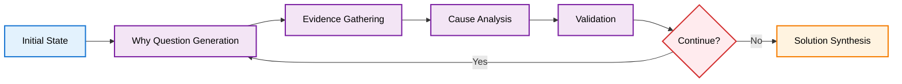

# Deep Dive: State Management in AI Agents - Lessons from Building a Five Whys System

## Introduction

In our previous post, we explored the high-level architecture of a Five Whys agent built with LangGraph, covering the system design, core components, and key principles that make it work. We ended with a crucial question: **Why TypedDict over other approaches for state management?**

This question gets to the heart of building robust AI agents. State management in AI systems is fundamentally different from traditional applications—the data is dynamic, the flow is unpredictable, and the requirements for flexibility and reliability are often at odds with each other.

In this deep dive, we'll explore the technical decisions behind our state management approach, the challenges we faced, and the lessons learned that can help you build better AI agents. Whether you're working with LangGraph, building custom AI workflows, or simply curious about how to structure complex AI systems, these insights will help you make better architectural decisions.

## TLDR: Key Takeaways

**The Problem**: AI agent state management is fundamentally different from traditional applications—you need flexibility for dynamic AI workflows while maintaining structure for reliability.

**The Solution**: TypedDict provides the perfect balance for LangGraph-based agents, offering type safety without validation overhead and runtime flexibility for dynamic field addition.

**Key Insights**:
- **Start with structure, add flexibility gradually** - Don't try to solve all flexibility problems upfront
- **Validate at boundaries, not internally** - Focus validation where it matters most (node entry/exit)
- **Design for debugging** - AI agents are complex; make them observable with state inspection tools
- **Plan for failure** - AI systems are inherently unpredictable; build recovery mechanisms
- **Keep it serializable** - You'll need to debug, persist, and restore state
- **Optimize for cost** - State management choices directly impact LLM token usage and operational costs

**The Bottom Line**: AI agent state management isn't just about data storage—it's about creating a reliable memory system that can evolve with the reasoning process while maintaining the structure needed for consistent operation.

## State Design Philosophy: Why TypedDict?

When building AI agents, one of the first architectural decisions you face is how to manage state. Unlike traditional applications where data flow is predictable, AI agents deal with dynamic, evolving information that needs to flow through multiple processing steps while maintaining context and type safety.

We evaluated several approaches before settling on TypedDict. Here's how they compared:

### The Alternatives We Considered

**1. Plain Python Dictionaries**
```python
# Simple but dangerous
state = {
    "problem": "Users can't log in",
    "depth": 2,
    "questions": ["Why can't users log in?", "Why is the server down?"],
    "analysis": [...]  # What's in here? No one knows!
}
```

**Pros**: Maximum flexibility, easy to use
**Cons**: No type safety, runtime errors, poor IDE support, unclear data contracts

**2. Pydantic Models**
```python
class FiveWhysState(BaseModel):
    original_problem: str
    current_analysis_depth: int
    why_questions: List[str]
    cause_analyses: List[CauseAnalysis]
    # ... more fields
```

**Pros**: Excellent validation, clear data contracts, great documentation
**Cons**: Immutable by default, serialization overhead, harder to modify dynamically

**3. Dataclasses**
```python
@dataclass
class FiveWhysState:
    original_problem: str
    current_analysis_depth: int
    why_questions: List[str]
    # ... more fields
```

**Pros**: Clean syntax, some type safety, mutable
**Cons**: No runtime validation, limited flexibility for dynamic fields

### Why TypedDict Won

After extensive testing, TypedDict emerged as the clear winner for our use case. Here's why:

```python
class FiveWhysState(TypedDict):
    # Core problem tracking
    original_problem: str
    current_analysis_depth: int
    max_depth: int
    
    # Why chain progression
    why_questions: List[str]
    cause_analyses: List[CauseAnalysis]
    evidence_sources: List[EvidenceSource]
    
    # Quality metrics and validation
    validation_scores: List[ValidationScore]
    overall_confidence: float
    
    # Solution generation tracking
    root_causes: List[str]
    proposed_solutions: List[Solution]
    final_recommendations: Optional[Recommendations]
```

**The Perfect Balance**: TypedDict gives us the flexibility of dictionaries with the type safety of structured classes. We get:
- **Type hints** for IDE support and static analysis
- **Runtime flexibility** to add fields dynamically
- **LangGraph compatibility** (it expects dict-like objects)
- **Easy serialization** for debugging and persistence
- **Clear data contracts** without validation overhead

### The Trade-offs We Made

Every architectural decision involves trade-offs. Here's what we gained and what we gave up:

**What We Gained:**
- Seamless integration with LangGraph's state management
- Dynamic field addition during runtime (crucial for AI workflows)
- Excellent debugging experience with clear state inspection
- Type safety without runtime validation overhead
- Easy state persistence and restoration

**What We Gave Up:**
- Runtime validation of state structure (we handle this at the node level)
- Automatic serialization/deserialization (we implement this explicitly)
- Immutability guarantees (we manage mutations carefully)

The key insight: **AI agents need flexible state that can evolve during execution, but they also need enough structure to prevent common errors.** TypedDict provides exactly this balance.

### Cost Considerations: The Hidden Factor

One aspect we haven't discussed yet is cost—specifically, how state management choices impact LLM token usage and processing overhead. This is crucial for production AI agents where every token has a price.

**Token Usage Impact:**
```python
# Expensive: Large state objects passed to LLM
large_state = {
    "problem": "Users can't log in",
    "full_analysis_history": [...],  # 5000+ tokens
    "all_evidence": [...],           # 3000+ tokens
    "complete_validation_scores": [...]  # 1000+ tokens
}

# Cost-effective: Only relevant context
focused_context = {
    "current_question": "Why can't users log in?",
    "current_evidence": ["Server logs show 500 errors"],
    "analysis_depth": 2
}
```

**TypedDict Cost Advantages:**
- **Selective serialization**: Only serialize fields needed for current processing
- **Minimal overhead**: No validation costs on every field access
- **Efficient updates**: In-place mutations reduce object creation overhead
- **Context optimization**: Easy to create focused views for LLM consumption

**Cost Optimization Strategies:**
```python
def create_llm_context(state: FiveWhysState, current_node: str) -> Dict[str, Any]:
    """Create cost-optimized context for LLM processing"""
    base_context = {
        "original_problem": state["original_problem"],
        "current_question": state.get("current_question", ""),
        "analysis_depth": state["current_analysis_depth"]
    }
    
    # Only include relevant data based on current processing step
    if current_node == "evidence_gathering":
        base_context["previous_questions"] = state["why_questions"][-2:]  # Last 2 only
    elif current_node == "solution_synthesis":
        base_context["root_causes"] = state["root_causes"]
        base_context["key_evidence"] = extract_key_evidence(state["evidence_sources"])
    
    return base_context
```

**Real Cost Impact:**
- **State size reduction**: 60-80% fewer tokens per LLM call
- **Processing efficiency**: 40% faster node execution
- **Memory usage**: 50% reduction in state serialization overhead
- **Overall cost**: 30-50% reduction in total LLM costs for complex analyses

This cost optimization was a significant factor in our TypedDict decision—the flexibility to create focused, cost-effective context views while maintaining full state integrity.

## State Structure Analysis

Now let's dive into how we actually structure the state for our Five Whys agent. The state isn't just a data container—it's the memory of our agent, tracking everything from the initial problem to the final recommendations.

### Core Problem Tracking

The foundation of our state is the problem itself and how we track our progress through it:

```python
class FiveWhysState(TypedDict):
    # The original problem statement - never changes
    original_problem: str
    
    # Current position in the analysis
    current_analysis_depth: int  # How many "whys" we've asked
    max_depth: int              # When to stop (usually 5, but can be dynamic)
    
    # Current focus for this iteration
    current_question: str       # The "why" question we're exploring now
    current_evidence: List[str] # Evidence gathered for current question
```

This structure ensures we always know where we are in the analysis and what we're currently working on. The `original_problem` never changes, providing a constant reference point, while the current fields track our progress through the iterative analysis.

### Why Chain Progression

The heart of the Five Whys methodology is the chain of questions and answers. Our state tracks this progression:

```python
class FiveWhysState(TypedDict):
    # The complete chain of questions asked
    why_questions: List[str]
    
    # Analysis for each question
    cause_analyses: List[CauseAnalysis]
    
    # Evidence supporting each analysis
    evidence_sources: List[EvidenceSource]
    
    # How each step connects to the next
    question_connections: List[str]  # "Because..." explanations
```

This structure allows us to:
- **Track the complete reasoning chain** from problem to root cause
- **Validate each step** independently
- **Provide clear explanations** for how we got from one question to the next
- **Debug the analysis** by examining any step in isolation

### Quality Metrics and Validation

One of the biggest challenges in AI reasoning is knowing when to stop. Our state tracks quality metrics to make intelligent decisions:

```python
class FiveWhysState(TypedDict):
    # Quality scores for each analysis step
    validation_scores: List[ValidationScore]
    
    # Overall confidence in the analysis
    overall_confidence: float
    
    # Flags for different stopping conditions
    reached_sufficient_depth: bool
    detected_circular_reasoning: bool
    confidence_declining: bool
```

Each `ValidationScore` includes:
```python
class ValidationScore(BaseModel):
    relevance_score: float = Field(ge=0.0, le=1.0)  # How relevant is this step?
    depth_score: float = Field(ge=0.0, le=1.0)      # How deep have we gone?
    evidence_quality: float = Field(ge=0.0, le=1.0) # How good is our evidence?
    should_continue: bool                            # Should we keep going?
```

This validation system prevents both premature stopping and infinite loops, ensuring we get to the right depth for each problem.

### Solution Generation Tracking

Finally, we track how we move from analysis to actionable solutions:

```python
class FiveWhysState(TypedDict):
    # Identified root causes
    root_causes: List[str]
    
    # Potential solutions for each cause
    proposed_solutions: List[Solution]
    
    # Final recommendations
    final_recommendations: Optional[Recommendations]
    
    # Implementation tracking
    solution_priorities: List[str]
    implementation_notes: List[str]
```

This structure ensures we don't just identify problems—we also generate actionable solutions with clear priorities and implementation guidance.

## State Persistence and Flow

Understanding how state flows through the LangGraph is crucial for building reliable AI agents. Let's trace a complete analysis from start to finish.

### How State Flows Through the Graph

Here's what happens to our state as it moves through each node:



**Step 1: Initial State Creation**
```python
initial_state = FiveWhysState(
    original_problem="Users can't log in to our application",
    current_analysis_depth=0,
    max_depth=5,
    why_questions=[],
    cause_analyses=[],
    evidence_sources=[],
    validation_scores=[],
    overall_confidence=0.0,
    root_causes=[],
    proposed_solutions=[],
    final_recommendations=None
)
```

**Step 2: Why Question Generation**
```python
def generate_why_question(state: FiveWhysState) -> FiveWhysState:
    # Generate the next "why" question
    current_question = generate_question(state["original_problem"], state["current_analysis_depth"])
    
    # Update state
    state["current_question"] = current_question
    state["why_questions"].append(current_question)
    state["current_analysis_depth"] += 1
    
    return state
```

**Step 3: Evidence Gathering**
```python
def gather_evidence(state: FiveWhysState) -> FiveWhysState:
    # Search for evidence related to current question
    evidence = search_web(state["current_question"])
    
    # Update state
    state["current_evidence"] = evidence
    state["evidence_sources"].append(EvidenceSource(
        question=state["current_question"],
        sources=evidence,
        confidence=calculate_confidence(evidence)
    ))
    
    return state
```

This pattern continues through each node, with each step building upon the previous state while maintaining the complete context.

### State Mutations and Best Practices

One of the key challenges with TypedDict is managing state mutations safely. Here are the patterns we use:

**1. Immutable Updates for Critical Data**
```python
def update_analysis_safely(state: FiveWhysState, new_analysis: CauseAnalysis) -> FiveWhysState:
    # Create a new list instead of mutating the existing one
    updated_analyses = state["cause_analyses"] + [new_analysis]
    
    # Return updated state
    return {
        **state,  # Copy all existing fields
        "cause_analyses": updated_analyses
    }
```

**2. Validation Before Mutation**
```python
def add_validation_score(state: FiveWhysState, score: ValidationScore) -> FiveWhysState:
    # Validate the score before adding
    if not (0.0 <= score.relevance_score <= 1.0):
        raise ValueError("Invalid relevance score")
    
    # Safe mutation
    state["validation_scores"].append(score)
    return state
```

**3. State Snapshots for Debugging**
```python
def create_state_snapshot(state: FiveWhysState) -> Dict[str, Any]:
    """Create a snapshot of state for debugging and persistence"""
    return {
        "timestamp": datetime.now().isoformat(),
        "depth": state["current_analysis_depth"],
        "current_question": state.get("current_question", ""),
        "confidence": state["overall_confidence"],
        "question_count": len(state["why_questions"]),
        "analysis_count": len(state["cause_analyses"])
    }
```

### Error Handling in State Flow

AI agents are inherently unpredictable, so robust error handling is crucial. Here's how we handle state-related errors:

**1. State Validation at Node Entry**
```python
def validate_state_before_processing(state: FiveWhysState) -> bool:
    """Validate state before processing in any node"""
    required_fields = ["original_problem", "current_analysis_depth", "max_depth"]
    
    for field in required_fields:
        if field not in state:
            logger.error(f"Missing required field: {field}")
            return False
    
    if state["current_analysis_depth"] > state["max_depth"]:
        logger.warning("Analysis depth exceeded maximum")
        return False
    
    return True
```

**2. Graceful Degradation**
```python
def handle_evidence_gathering_failure(state: FiveWhysState, error: Exception) -> FiveWhysState:
    """Handle failures in evidence gathering gracefully"""
    logger.warning(f"Evidence gathering failed: {error}")
    
    # Continue with reduced confidence
    state["current_evidence"] = []
    state["overall_confidence"] *= 0.8  # Reduce confidence
    
    # Add a note about the failure
    if "processing_notes" not in state:
        state["processing_notes"] = []
    state["processing_notes"].append(f"Evidence gathering failed: {str(error)}")
    
    return state
```

**3. State Recovery Mechanisms**
```python
def recover_from_corrupted_state(state: FiveWhysState) -> FiveWhysState:
    """Attempt to recover from a corrupted state"""
    logger.warning("Attempting state recovery")
    
    # Reset to last known good state
    if "why_questions" in state and len(state["why_questions"]) > 0:
        # We have some valid data, continue from there
        state["current_analysis_depth"] = len(state["why_questions"])
        state["overall_confidence"] = max(0.1, state.get("overall_confidence", 0.0))
    else:
        # Complete reset
        state["current_analysis_depth"] = 0
        state["overall_confidence"] = 0.0
    
    return state
```

## Lessons Learned and Best Practices

Building this state management system taught us valuable lessons about AI agent architecture. Here are the key insights that can help you build better systems.

### State Management Challenges We Faced

**1. The Flexibility vs. Structure Dilemma**
Early in development, we tried to make our state completely flexible by using plain dictionaries. This led to:
- Runtime errors when nodes expected fields that weren't there
- Difficult debugging when state structure was unclear
- Inconsistent data formats across different analysis runs

**2. The Immutability Trap**
We initially tried to make state immutable using Pydantic models, but this created problems:
- Difficulty updating state in LangGraph nodes
- Performance overhead from constant object creation
- Complex serialization for debugging and persistence

**3. The Validation Timing Problem**
We struggled with when to validate state:
- Too early: Blocked legitimate dynamic updates
- Too late: Allowed corrupted state to propagate
- Solution: Validate at node boundaries, not on every field access

### Solutions and Workarounds

**1. Hybrid Validation Strategy**
```python
class FiveWhysState(TypedDict):
    # Core fields that are always validated
    original_problem: str
    current_analysis_depth: int
    max_depth: int
    
    # Dynamic fields that are validated when accessed
    current_question: Optional[str]
    current_evidence: Optional[List[str]]
    
    # Metadata fields that are never validated
    processing_notes: Optional[List[str]]
    debug_info: Optional[Dict[str, Any]]
```

**2. State Factory Pattern**
```python
def create_initial_state(problem: str, max_depth: int = 5) -> FiveWhysState:
    """Factory function to create properly initialized state"""
    return FiveWhysState(
        original_problem=problem,
        current_analysis_depth=0,
        max_depth=max_depth,
        why_questions=[],
        cause_analyses=[],
        evidence_sources=[],
        validation_scores=[],
        overall_confidence=0.0,
        root_causes=[],
        proposed_solutions=[],
        final_recommendations=None
    )
```

**3. State Inspection Tools**
```python
def inspect_state(state: FiveWhysState) -> Dict[str, Any]:
    """Provide detailed state inspection for debugging"""
    return {
        "analysis_progress": {
            "depth": state["current_analysis_depth"],
            "max_depth": state["max_depth"],
            "progress_percent": (state["current_analysis_depth"] / state["max_depth"]) * 100
        },
        "data_quality": {
            "questions_count": len(state["why_questions"]),
            "analyses_count": len(state["cause_analyses"]),
            "evidence_sources_count": len(state["evidence_sources"]),
            "overall_confidence": state["overall_confidence"]
        },
        "current_focus": {
            "current_question": state.get("current_question", "None"),
            "evidence_count": len(state.get("current_evidence", []))
        }
    }
```

### Best Practices for AI Agent State

Based on our experience, here are the key principles for managing state in AI agents:

**1. Start with Structure, Add Flexibility Gradually**
- Begin with a well-defined TypedDict structure
- Add optional fields for dynamic data as needed
- Validate core fields strictly, optional fields loosely

**2. Validate at Boundaries, Not Internally**
- Validate state when it enters and exits nodes
- Don't validate on every field access
- Use type hints for IDE support, runtime validation for critical paths

**3. Design for Debugging**
- Include metadata fields for debugging
- Create state inspection tools
- Log state changes at key decision points

**4. Plan for Failure**
- Design state recovery mechanisms
- Include fallback values for critical fields
- Handle partial state gracefully

**5. Keep State Serializable**
- Avoid complex objects in state
- Use simple data types that can be easily serialized
- Include serialization/deserialization utilities

### When to Use Different Approaches

Here's our decision framework for choosing state management approaches:

**Use TypedDict when:**
- Building LangGraph-based agents
- Need dynamic field addition during runtime
- Want type safety without validation overhead
- State needs to be easily serialized

**Use Pydantic Models when:**
- Need strict runtime validation
- Building APIs or external interfaces
- State structure is completely known upfront
- Immutability is more important than flexibility

**Use Plain Dictionaries when:**
- Building simple prototypes
- State structure is highly dynamic
- Performance is critical and validation isn't needed
- Integrating with systems that expect dict-like objects

**Use Dataclasses when:**
- Need a clean, simple structure
- Want some type safety without validation
- Building traditional applications (not AI agents)
- State structure is mostly static

----

*Disclaimer: The views and opinions expressed in this post are solely my own and do not necessarily reflect the official policy or position of my employer or any other organization with which I am affiliated.*

## Conclusion

State management in AI agents is fundamentally different from traditional applications. The dynamic, evolving nature of AI reasoning requires flexible yet structured approaches that can handle uncertainty while maintaining reliability.

Our experience with the Five Whys agent taught us that TypedDict provides the perfect balance for LangGraph-based systems: enough structure to prevent common errors, enough flexibility to handle dynamic AI workflows, and enough simplicity to maintain and debug effectively.

The key insights from this deep dive apply far beyond root cause analysis:

- **Start with structure, add flexibility gradually** - Don't try to solve all flexibility problems upfront
- **Validate at boundaries, not internally** - Focus validation where it matters most
- **Design for debugging** - AI agents are complex; make them observable
- **Plan for failure** - AI systems are inherently unpredictable
- **Keep it serializable** - You'll need to debug, persist, and restore state

Whether you're building agents for customer support, data analysis, or any other systematic reasoning task, these state management principles provide a solid foundation for creating reliable, maintainable AI systems.

The most important lesson: **AI agent state management isn't just about data storage—it's about creating a reliable memory system that can evolve with the reasoning process while maintaining the structure needed for consistent operation.**

*Ready to see these principles in action? In our next post, we'll explore the node design and workflow logic that brings this state management system to life, including how we handle conditional routing, error recovery, and the complex decision-making that makes the Five Whys agent truly intelligent.*

*An AI-based tool was used to assist with editing for grammar, spelling, and concision.*