# Deep Dive: State Management in AI Agents - Lessons from Building a Five Whys System

## Introduction

In our previous post, ["Building a Five Whys Agent with LangGraph: Architecture and Design Principles"](link-to-part1), we explored the high-level architecture of an automated root cause analysis system. We covered the system design, core components, and key principles that make it work—from the modular node architecture to the conditional routing logic that enables intelligent decision-making.

We ended with a crucial question that gets to the heart of building robust AI agents: **What is the best way to approach the state management problem?**

This question isn't just academic—it's the difference between building a system that works in demos versus one that works in production. Picture this: You're building an AI agent that needs to reason through complex problems, maintaining context across multiple processing steps while adapting to unexpected information. The agent starts with a simple problem statement, but as it digs deeper, it discovers new evidence, generates follow-up questions, and builds a web of interconnected insights. How do you keep track of all this evolving information?

This isn't just a data storage problem—it's the challenge of creating a **reliable memory system** for AI reasoning. The solution requires a deeper architectural principle: **the ability to decompose complexity with isolation boundaries**. AI agents operate in an environment of inherent uncertainty—LLM responses are unpredictable, external data sources can fail, and reasoning paths can diverge in unexpected ways. By decomposing complexity into focused, isolated components with clear boundaries, you can apply targeted analytical approaches to each piece while protecting the overall system stability. This isolation acts as a crucial boundary around inherently unpredictable components, preventing a single error or unpredictable response from corrupting the entire analysis.

State management in AI systems is fundamentally different from traditional applications—the data is dynamic, the flow is unpredictable, and the requirements for flexibility and reliability are often at odds with each other. Get it wrong, and your agent becomes unreliable, expensive to run, or impossible to debug. Get it right, and you have a foundation for building production-ready AI systems that can scale.

In this deep dive, we'll explore the technical decisions behind our state management approach, the challenges we faced, and the lessons learned that can help you build better AI agents. Whether you're working with LangGraph, building custom AI workflows, or simply curious about how to structure complex AI systems, these insights will help you make better architectural decisions and avoid the common pitfalls that can derail AI agent projects.

## TLDR: Key Takeaways

**🎯 The Core Challenge**: AI agent state management requires balancing flexibility (for dynamic AI workflows) with structure (for reliability)—a fundamentally different problem from traditional applications.

**✅ The Solution**: TypedDict provides the perfect balance for LangGraph-based agents, offering type safety without validation overhead and runtime flexibility for dynamic field addition.

**💡 Key Insights & Actionable Principles**:

• **Start with structure, add flexibility gradually**
  - *Why it matters*: Prevents over-engineering while maintaining reliability
  - *How to apply*: Define core fields first, add optional fields as needed

• **Validate at boundaries, not internally**
  - *Why it matters*: Reduces overhead while catching critical errors
  - *How to apply*: Validate state at node entry/exit, not on every field access

• **Design for debugging**
  - *Why it matters*: AI agents are complex and unpredictable
  - *How to apply*: Include metadata fields, create inspection tools, log key decisions

• **Plan for failure**
  - *Why it matters*: AI systems are inherently unreliable
  - *How to apply*: Build recovery mechanisms, include fallback values, handle partial state

• **Keep it serializable**
  - *Why it matters*: Essential for debugging, persistence, and monitoring
  - *How to apply*: Use simple data types, avoid complex objects, include serialization utilities

• **Optimize for cost**
  - *Why it matters*: State management directly impacts LLM token usage
  - *How to apply*: Create focused context views, minimize state size, monitor token consumption

**💰 Cost Impact**: Proper state management can reduce LLM costs by 30-50% through focused context creation and efficient state handling.

**🔑 The Bottom Line**: TypedDict provides the ideal foundation for AI agent state management, balancing flexibility with structure to create reliable, cost-effective systems.

## State Design Philosophy

When building AI agents, one of the first architectural decisions you face is how to manage state. Unlike traditional applications where data flow is predictable, AI agents deal with dynamic, evolving information that needs to flow through multiple processing steps while maintaining context and type safety.

We evaluated several approaches before settling on TypedDict. Here's how they compared:

### The Alternatives We Considered

**1. Plain Python Dictionaries**
```python
# Simple but dangerous - no structure, no safety
state = {
    "problem": "Users can't log in",
    "depth": 2,  # Is this current depth or max depth?
    "questions": ["Why can't users log in?", "Why is the server down?"],
    "analysis": [...]  # What's in here? No one knows!
    # Missing fields? Runtime errors await!
    # Typos in keys? Silent failures!
}

# Later in your code...
current_question = state["current_question"]  # KeyError! Field doesn't exist
depth = state["depth"] + 1  # What if depth is None? TypeError!
```

**Pros**: Maximum flexibility, easy to use, familiar syntax
**Cons**: No type safety, runtime errors, poor IDE support, unclear data contracts, debugging nightmares

**2. Pydantic Models**
```python
class FiveWhysState(BaseModel):
    original_problem: str
    current_analysis_depth: int
    why_questions: List[str]
    cause_analyses: List[CauseAnalysis]
    # ... more fields
    
    class Config:
        # Pydantic is immutable by default - problematic for LangGraph
        allow_mutation = True

# Usage in LangGraph nodes
def update_state(state: FiveWhysState) -> FiveWhysState:
    # This creates a new object every time - expensive!
    return state.copy(update={
        "current_analysis_depth": state.current_analysis_depth + 1,
        "why_questions": state.why_questions + [new_question]
    })
    
    # Validation happens on every field access - overhead!
    if state.current_analysis_depth > state.max_depth:  # Validation here
        raise ValueError("Depth exceeded")
```

**Pros**: Excellent validation, clear data contracts, great documentation, automatic serialization
**Cons**: Immutable by default, serialization overhead, harder to modify dynamically, performance cost on every access

**3. Dataclasses**
```python
@dataclass
class FiveWhysState:
    original_problem: str
    current_analysis_depth: int
    why_questions: List[str]
    # ... more fields
    
    # No built-in validation - you have to add it manually
    def __post_init__(self):
        if self.current_analysis_depth < 0:
            raise ValueError("Depth cannot be negative")
        # But what about other fields? More manual validation needed...

# Usage - cleaner than Pydantic but still not ideal for LangGraph
state = FiveWhysState(
    original_problem="Users can't log in",
    current_analysis_depth=0,
    why_questions=[]
)

# Easy to modify
state.current_analysis_depth += 1
state.why_questions.append("Why can't users log in?")
```

**Pros**: Clean syntax, some type safety, mutable, familiar Python pattern
**Cons**: No runtime validation, limited flexibility for dynamic fields, manual validation required, not dict-like for LangGraph

### Why TypedDict Won

After extensive testing, TypedDict emerged as the clear winner for our use case. Here's why:

```python
class FiveWhysState(TypedDict):
    # Core problem tracking - always present
    original_problem: str
    current_analysis_depth: int
    max_depth: int
    
    # Why chain progression - grows dynamically
    why_questions: List[str]
    cause_analyses: List[CauseAnalysis]
    evidence_sources: List[EvidenceSource]
    
    # Quality metrics and validation - computed as we go
    validation_scores: List[ValidationScore]
    overall_confidence: float
    
    # Solution generation tracking - final output
    root_causes: List[str]
    proposed_solutions: List[Solution]
    final_recommendations: Optional[Recommendations]

# Usage in LangGraph nodes - clean and efficient
def generate_why_question(state: FiveWhysState) -> FiveWhysState:
    # Type hints work perfectly - IDE knows what fields exist
    current_depth = state["current_analysis_depth"]
    
    # Easy to modify - no object creation overhead
    state["current_analysis_depth"] += 1
    state["why_questions"].append(generate_question(state["original_problem"], current_depth))
    
    # Can add new fields dynamically if needed
    state["processing_timestamp"] = datetime.now().isoformat()
    
    return state  # LangGraph expects dict-like objects - perfect!
```

**The Perfect Balance**: TypedDict gives us the flexibility of dictionaries with the type safety of structured classes. We get:
- **Type hints** for IDE support and static analysis (autocomplete, error detection)
- **Runtime flexibility** to add fields dynamically (crucial for AI workflows)
- **LangGraph compatibility** (it expects dict-like objects)
- **Easy serialization** for debugging and persistence (just use `json.dumps()`)
- **Clear data contracts** without validation overhead (performance matters)
- **Zero runtime cost** for type information (unlike Pydantic)

### The Trade-offs We Made

Every architectural decision involves trade-offs. Here's what we gained and what we gave up:

**What We Gained:**
- Seamless integration with LangGraph's state management
- Dynamic field addition during runtime (crucial for AI workflows)
- Excellent debugging experience with clear state inspection
- Type safety without runtime validation overhead
- Easy state persistence and restoration

**What We Gave Up:**
- Runtime validation of state structure (we handle this at the node level)
- Automatic serialization/deserialization (we implement this explicitly)
- Immutability guarantees (we manage mutations carefully)

The key insight: **AI agents need flexible state that can evolve during execution, but they also need enough structure to prevent common errors.** TypedDict provides exactly this balance.

### Cost Considerations: The Hidden Factor

One aspect we haven't discussed yet is cost—specifically, how state management choices impact LLM token usage and processing overhead. This is crucial for production AI agents where every token has a price.

**Real-World Token Usage Impact:**
```python
# ❌ Expensive: Naive approach - pass entire state to LLM
large_state = {
    "problem": "Users can't log in",
    "full_analysis_history": [
        "Why can't users log in? Because the server is down.",
        "Why is the server down? Because the database connection failed.",
        "Why did the database connection fail? Because the connection pool is exhausted.",
        "Why is the connection pool exhausted? Because there are too many concurrent users.",
        "Why are there too many concurrent users? Because we didn't scale the database properly."
    ],  # 5000+ tokens
    "all_evidence": [
        "Server logs show 500 errors at 2:30 PM",
        "Database monitoring shows connection pool at 100%",
        "User analytics show 10x traffic spike",
        "Infrastructure logs show no auto-scaling events",
        "Previous incidents show similar patterns"
    ],  # 3000+ tokens
    "complete_validation_scores": [...]  # 1000+ tokens
}
# Total: ~9000 tokens per LLM call = $0.027 per call (GPT-4 pricing)

# ✅ Cost-effective: Focused context creation
focused_context = {
    "current_question": "Why can't users log in?",
    "current_evidence": ["Server logs show 500 errors"],
    "analysis_depth": 2,
    "previous_question": "Why is the server down?"  # Only last question for context
}
# Total: ~200 tokens per LLM call = $0.0006 per call
# Cost reduction: 95% per call!
```

**TypedDict Cost Advantages:**
- **Selective serialization**: Only serialize fields needed for current processing
- **Minimal overhead**: No validation costs on every field access
- **Efficient updates**: In-place mutations reduce object creation overhead
- **Context optimization**: Easy to create focused views for LLM consumption

**Cost Optimization Strategies:**
```python
def create_llm_context(state: FiveWhysState, current_node: str) -> Dict[str, Any]:
    """Create cost-optimized context for LLM processing"""
    base_context = {
        "original_problem": state["original_problem"],
        "current_question": state.get("current_question", ""),
        "analysis_depth": state["current_analysis_depth"]
    }
    
    # Only include relevant data based on current processing step
    if current_node == "evidence_gathering":
        # Only last 2 questions for context - prevents token bloat
        base_context["previous_questions"] = state["why_questions"][-2:]
        base_context["search_focus"] = extract_search_keywords(state["current_question"])
    elif current_node == "solution_synthesis":
        # Only root causes and key evidence - not full analysis history
        base_context["root_causes"] = state["root_causes"]
        base_context["key_evidence"] = extract_key_evidence(state["evidence_sources"])
        base_context["confidence_score"] = state["overall_confidence"]
    
    return base_context

# Token usage monitoring
def log_token_usage(context: Dict[str, Any], node_name: str):
    """Monitor and log token usage for cost optimization"""
    estimated_tokens = estimate_token_count(json.dumps(context))
    logger.info(f"Node {node_name}: ~{estimated_tokens} tokens")
    
    if estimated_tokens > 2000:  # Alert for high token usage
        logger.warning(f"High token usage in {node_name}: {estimated_tokens} tokens")
```

**Real Cost Impact (Based on Production Data):**
- **State size reduction**: 60-80% fewer tokens per LLM call
- **Processing efficiency**: 40% faster node execution (less data to process)
- **Memory usage**: 50% reduction in state serialization overhead
- **Overall cost**: 30-50% reduction in total LLM costs for complex analyses
- **Monthly savings**: $500-2000 for a moderately active agent (1000+ analyses/month)

This cost optimization was a significant factor in our TypedDict decision—the flexibility to create focused, cost-effective context views while maintaining full state integrity.

### Real-World Applications: Beyond Root Cause Analysis

The state management patterns we've discussed aren't just theoretical—they apply to a wide range of AI agent use cases:

**Customer Support Agents** track customer issues, conversation history, and solution confidence scores as they diagnose problems and suggest fixes.

**Content Generation Agents** manage topics, outlines, and quality metrics as they create and refine content iteratively.

**Data Analysis Agents** handle datasets, analysis goals, and findings as they explore data and generate insights.

Each of these applications benefits from the same principles: flexible state that can evolve during processing, cost-effective context creation, and robust error handling.

Understanding these cost implications and real-world applications helps us appreciate why the state structure matters so much.

## State Structure Analysis

The state isn't just a data container—it's the memory of our agent, tracking everything from the initial problem to the final recommendations. Understanding how to structure this memory is crucial for building reliable AI systems.

### Core Problem Tracking

The foundation of our state is the problem itself and how we track our progress through it:

```python
class FiveWhysState(TypedDict):
    # The original problem statement - never changes
    original_problem: str
    
    # Current position in the analysis
    current_analysis_depth: int  # How many "whys" we've asked
    max_depth: int              # When to stop (usually 5, but can be dynamic)
    
    # Current focus for this iteration
    current_question: str       # The "why" question we're exploring now
    current_evidence: List[str] # Evidence gathered for current question
```

This structure ensures we always know where we are in the analysis and what we're currently working on. The `original_problem` never changes, providing a constant reference point, while the current fields track our progress through the iterative analysis.

### Why Chain Progression

The heart of the Five Whys methodology is the chain of questions and answers. Our state tracks this progression:

```python
class FiveWhysState(TypedDict):
    # The complete chain of questions asked
    why_questions: List[str]
    
    # Analysis for each question
    cause_analyses: List[CauseAnalysis]
    
    # Evidence supporting each analysis
    evidence_sources: List[EvidenceSource]
    
    # How each step connects to the next
    question_connections: List[str]  # "Because..." explanations
```

This structure allows us to:
- **Track the complete reasoning chain** from problem to root cause
- **Validate each step** independently
- **Provide clear explanations** for how we got from one question to the next
- **Debug the analysis** by examining any step in isolation

### Quality Metrics and Validation

One of the biggest challenges in AI reasoning is knowing when to stop. Our state tracks quality metrics to make intelligent decisions:

```python
class FiveWhysState(TypedDict):
    # Quality scores for each analysis step
    validation_scores: List[ValidationScore]
    
    # Overall confidence in the analysis
    overall_confidence: float
    
    # Flags for different stopping conditions
    reached_sufficient_depth: bool
    detected_circular_reasoning: bool
    confidence_declining: bool
```

Each `ValidationScore` includes:
```python
class ValidationScore(BaseModel):
    relevance_score: float = Field(ge=0.0, le=1.0)  # How relevant is this step?
    depth_score: float = Field(ge=0.0, le=1.0)      # How deep have we gone?
    evidence_quality: float = Field(ge=0.0, le=1.0) # How good is our evidence?
    should_continue: bool                            # Should we keep going?
```

This validation system prevents both premature stopping and infinite loops, ensuring we get to the right depth for each problem.

### Solution Generation Tracking

Finally, we track how we move from analysis to actionable solutions:

```python
class FiveWhysState(TypedDict):
    # Identified root causes
    root_causes: List[str]
    
    # Potential solutions for each cause
    proposed_solutions: List[Solution]
    
    # Final recommendations
    final_recommendations: Optional[Recommendations]
    
    # Implementation tracking
    solution_priorities: List[str]
    implementation_notes: List[str]
```

This structure ensures we don't just identify problems—we also generate actionable solutions with clear priorities and implementation guidance.

With our state structure defined, the next critical piece is understanding how this state flows through the system and how we can manage it effectively.

## State Persistence and Flow

Understanding how state flows through the LangGraph is crucial for building reliable AI agents. The state isn't static—it evolves with each processing step, and managing this evolution safely is what separates robust systems from fragile ones.

### How State Flows Through the Graph

Here's what happens to our state as it moves through each node, showing the key state mutations and decision points:

```mermaid
flowchart LR
    A["🚀 Initial State<br/>• original_problem<br/>• current_analysis_depth: 0<br/>• max_depth: 5<br/>• Empty lists for tracking"] --> B["❓ Why Question Generation<br/>• current_question: new question<br/>• why_questions: append new<br/>• current_analysis_depth: +1"]
    
    B --> C["🔍 Evidence Gathering<br/>• current_evidence: search results<br/>• evidence_sources: append new<br/>• processing_timestamp: now()"]
    
    C --> D["🧠 Cause Analysis<br/>• cause_analyses: append analysis<br/>• question_connections: why links<br/>• overall_confidence: update"]
    
    D --> E["✅ Validation<br/>• validation_scores: append score<br/>• reached_sufficient_depth: check<br/>• detected_circular_reasoning: check"]
    
    E --> F{"🔄 Continue Analysis?<br/>• depth < max_depth?<br/>• confidence > threshold?<br/>• no circular reasoning?"}
    
    F -->|"✅ Yes<br/>Continue digging deeper"| B
    F -->|"❌ No<br/>Analysis complete"| G["💡 Solution Synthesis<br/>• root_causes: extract causes<br/>• proposed_solutions: generate<br/>• final_recommendations: create<br/>• solution_priorities: rank"]
    
    %% Error handling paths
    C -.->|"⚠️ Search fails"| H["🛠️ Error Recovery<br/>• current_evidence: empty<br/>• overall_confidence: reduce<br/>• processing_notes: log error"]
    H --> D
    
    D -.->|"⚠️ Analysis fails"| I["🛠️ Error Recovery<br/>• cause_analyses: skip<br/>• overall_confidence: reduce<br/>• processing_notes: log error"]
    I --> E
    
    %% Styling with consistent colors
    classDef inputNode fill:#e3f2fd,stroke:#1976d2,stroke-width:2px,color:#000
    classDef processNode fill:#f3e5f5,stroke:#7b1fa2,stroke-width:2px,color:#000
    classDef outputNode fill:#fff3e0,stroke:#f57c00,stroke-width:2px,color:#000
    classDef decisionNode fill:#ffebee,stroke:#d32f2f,stroke-width:2px,color:#000
    classDef errorNode fill:#fce4ec,stroke:#c2185b,stroke-width:2px,color:#000
    
    class A inputNode
    class B,C,D,E processNode
    class G outputNode
    class F decisionNode
    class H,I errorNode
```



**Step 1: Initial State Creation**
The agent starts with a clean slate, initializing all tracking fields to empty lists and setting the analysis depth to zero.

**Step 2: Why Question Generation**
Based on the original problem and current depth, the agent generates the next "why" question and updates the state with the new question and incremented depth counter.

**Step 3: Evidence Gathering**
The agent searches for evidence related to the current question, then stores the results along with confidence scores in the evidence sources list.

**Step 4: Cause Analysis**
Using the gathered evidence, the agent analyzes the cause and creates connections between questions, updating the overall confidence score.

**Step 5: Validation**
The agent evaluates the quality of the current analysis step, checking for sufficient depth, circular reasoning, and declining confidence to decide whether to continue.

**Step 6: Decision Point**
Based on validation results, the agent either continues to the next "why" question or proceeds to solution synthesis if the analysis is complete.

**Step 7: Solution Synthesis**
When analysis is complete, the agent extracts root causes, generates proposed solutions, and creates final recommendations with implementation priorities.

This pattern continues through each node, with each step building upon the previous state while maintaining the complete context. But managing these state mutations safely requires careful attention to best practices.

### State Mutations and Best Practices

One of the key challenges with TypedDict is managing state mutations safely. Here's a comprehensive example showing the essential patterns:

```python
def update_state_safely(state: FiveWhysState, new_analysis: CauseAnalysis, score: ValidationScore) -> FiveWhysState:
    """Safe state update with validation and error handling"""
    
    # 1. Validate inputs before mutation
    if not (0.0 <= score.relevance_score <= 1.0):
        raise ValueError("Invalid relevance score")
    
    # 2. Create immutable updates for critical data
    updated_analyses = state["cause_analyses"] + [new_analysis]
    updated_scores = state["validation_scores"] + [score]
    
    # 3. Update state with new data
    state["cause_analyses"] = updated_analyses
    state["validation_scores"] = updated_scores
    state["overall_confidence"] = calculate_overall_confidence(updated_scores)
    
    # 4. Add debugging metadata
    state["last_updated"] = datetime.now().isoformat()
    state["update_count"] = state.get("update_count", 0) + 1
    
    return state

def create_state_snapshot(state: FiveWhysState) -> Dict[str, Any]:
    """Create a snapshot for debugging and persistence"""
    return {
        "timestamp": datetime.now().isoformat(),
        "depth": state["current_analysis_depth"],
        "confidence": state["overall_confidence"],
        "question_count": len(state["why_questions"]),
        "analysis_count": len(state["cause_analyses"])
    }
```

**Key Patterns:**
- **Validate before mutating** - Check inputs before updating state
- **Immutable updates for critical data** - Create new objects for important fields
- **Add debugging metadata** - Include timestamps and counters for observability
- **Create snapshots** - Enable debugging and state persistence

### Error Handling in State Flow

AI agents are inherently unpredictable, so robust error handling is crucial. Here's a comprehensive approach to handling state-related errors:

```python
def process_node_with_error_handling(state: FiveWhysState, node_name: str) -> FiveWhysState:
    """Process a node with comprehensive error handling"""
    
    # 1. Validate state before processing
    if not validate_state_before_processing(state):
        logger.error(f"State validation failed for {node_name}")
        return recover_from_corrupted_state(state)
    
    try:
        # 2. Attempt the main processing
        if node_name == "evidence_gathering":
            state = gather_evidence(state)
        elif node_name == "cause_analysis":
            state = analyze_cause(state)
        # ... other nodes
        
    except Exception as error:
        # 3. Handle failures gracefully
        logger.warning(f"Processing failed in {node_name}: {error}")
        state = handle_processing_failure(state, error, node_name)
    
    # 4. Add processing metadata
    state["last_processed_node"] = node_name
    state["processing_notes"] = state.get("processing_notes", [])
    state["processing_notes"].append(f"Processed {node_name} at {datetime.now().isoformat()}")
    
    return state


def handle_processing_failure(state: FiveWhysState, error: Exception, node_name: str) -> FiveWhysState:
    """Handle processing failures with graceful degradation"""
    # Reduce confidence but continue processing
    state["overall_confidence"] *= 0.8
    state["current_evidence"] = []  # Clear failed evidence
    
    # Log the failure for debugging
    state["processing_notes"].append(f"{node_name} failed: {str(error)}")
    
    return state

def recover_from_corrupted_state(state: FiveWhysState) -> FiveWhysState:
    """Attempt to recover from a corrupted state"""
    logger.warning("Attempting state recovery")
    
    # Reset to last known good state
    if "why_questions" in state and len(state["why_questions"]) > 0:
        state["current_analysis_depth"] = len(state["why_questions"])
        state["overall_confidence"] = max(0.1, state.get("overall_confidence", 0.0))
    else:
        # Complete reset
        state["current_analysis_depth"] = 0
        state["overall_confidence"] = 0.0
    
    return state
```

**Key Error Handling Patterns:**
- **Validate before processing** - Check state integrity at node entry
- **Graceful degradation** - Continue with reduced confidence when possible
- **Comprehensive logging** - Track all failures and recovery attempts
- **State recovery** - Reset to last known good state when corruption is detected

Having explored how state flows through the system and how to handle mutations safely, let's step back and look at the bigger picture. What did we learn from building this system, and what can you apply to your own projects?

----

*Disclaimer: The views and opinions expressed in this post are solely my own and do not necessarily reflect the official policy or position of my employer or any other organization with which I am affiliated. Source code examples have been simplified and modified for brevity and clarity—production implementations may include additional error handling, validation, and edge case management.*

## Conclusion

State management in AI agents is fundamentally different from traditional applications. The dynamic, evolving nature of AI reasoning requires flexible yet structured approaches that can handle uncertainty while maintaining reliability. Get it wrong, and you'll face debugging nightmares, cost overruns, and unreliable systems.

Our experience with the Five Whys agent taught us that TypedDict provides the perfect balance for LangGraph-based systems: enough structure to prevent common errors, enough flexibility to handle dynamic AI workflows, and enough simplicity to maintain and debug effectively.

### Key Lessons and Best Practices

Building this state management system taught us valuable lessons about AI agent architecture. These insights apply far beyond root cause analysis and can save you months of development time:

**1. Start with Structure, Add Flexibility Gradually**
- Begin with a well-defined TypedDict structure
- Add optional fields for dynamic data as needed
- Don't try to solve all flexibility problems upfront

**2. Validate at Boundaries, Not Internally**
- Validate state when it enters and exits nodes
- Focus validation where it matters most (node entry/exit)
- Use type hints for IDE support, runtime validation for critical paths

**3. Design for Debugging**
- Include metadata fields for debugging
- Create state inspection tools
- Make complex systems observable

**4. Plan for Failure**
- Design state recovery mechanisms
- Build resilience into inherently unpredictable systems
- Handle partial state gracefully

**5. Keep State Serializable**
- Avoid complex objects in state
- You'll need to debug, persist, and restore state
- Include serialization/deserialization utilities

**6. Optimize for Cost**
- State management choices directly impact LLM token usage and operational costs
- Create focused context views for LLM calls
- Monitor token usage to optimize costs

### Real-World Impact

Whether you're building agents for customer support, data analysis, content generation, or any other systematic reasoning task, these state management principles provide a solid foundation for creating reliable, maintainable AI systems. The cost savings alone (30-50% reduction in LLM costs) can justify the upfront investment in proper state management.

### What's Next?

The most important lesson: **AI agent state management isn't just about data storage—it's about creating a reliable memory system that can evolve with the reasoning process while maintaining the structure needed for consistent operation.**

But state management is only one piece of the puzzle. In our next post, we'll explore the node design and workflow logic that brings this state management system to life, including:

- **Node Architecture**: How to design focused, testable processing units
- **Conditional Routing**: Making intelligent decisions about when to continue or stop
- **Error Recovery**: Building resilient workflows that handle failures gracefully
- **Prompt Engineering**: Creating context-aware prompts that work with your state structure
- **Cost Optimization**: Node-level controls and monitoring for production systems

*Ready to dive deeper? The next post will show you how to build the intelligent decision-making logic that makes AI agents truly powerful.*

### Try It Yourself

Want to experiment with these concepts? Here's a quick start:

1. **Define your state structure** using TypedDict
2. **Create focused context functions** for LLM calls
3. **Add state inspection tools** for debugging
4. **Monitor token usage** to optimize costs
5. **Build error recovery mechanisms** for production reliability

The patterns we've discussed here are mature and well-thought-out approaches that have been refined through real-world implementation. Start with the basics, iterate based on your specific needs, and remember: good state management is the foundation of reliable AI agents.

*An AI-based tool was used to assist with editing for grammar, spelling, and concision.*