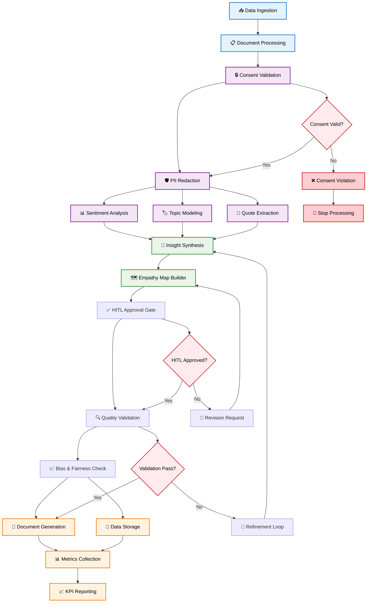
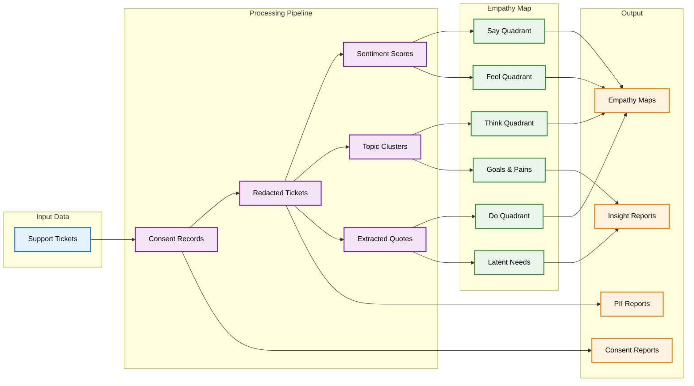
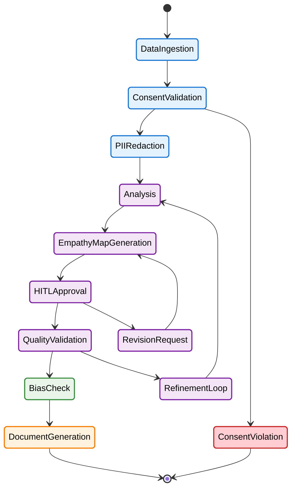

# Empathy Synthesizer Agent - Workflow Diagram

## Node Descriptions

### **Input & Processing Nodes**
- **📥 Data Ingestion**: Receives support tickets
- **📋 Document Processing**: Normalizes and structures incoming support ticket data
- **🔒 Consent Validation**: Checks user consent for data processing
- **🛡️ PII Redaction**: Removes personally identifiable information

### **Analysis Nodes**
- **📊 Sentiment Analysis**: Analyzes emotional tone and sentiment
- **🏷️ Topic Modeling**: Identifies key themes and topics
- **💬 Quote Extraction**: Extracts relevant user quotes
- **🧠 Insight Synthesis**: Combines analysis results into insights

### **Empathy Map Generation**
- **🗺️ Empathy Map Builder**: Creates Say/Think/Do/Feel quadrants
- **✅ HITL Approval Gate**: Human review and approval
- **🔍 Quality Validation**: Validates empathy map quality
- **📈 Bias & Fairness Check**: Ensures unbiased analysis

### **Output & Storage**
- **📄 Document Generation**: Creates empathy maps and reports
- **💾 Data Storage**: Stores results in PostgreSQL
- **📊 Metrics Collection**: Tracks KPIs and performance
- **📈 KPI Reporting**: Generates performance reports

### **Decision Points**
- **Validation Pass?**: Checks if quality standards are met
- **HITL Approved?**: Confirms human approval
- **Consent Valid?**: Validates user consent

### **Error Handling**
- **❌ Consent Violation**: Handles consent violations
- **🚫 Stop Processing**: Halts processing on violations
- **🔄 Refinement Loop**: Iterative improvement process

## Data Flow

## State Transitions

## Key Interactions

1. **Consent-First Processing**: All data must pass consent validation before processing
2. **PII Protection**: Automatic redaction before any analysis
3. **Multi-Modal Analysis**: Sentiment, topic, and quote analysis run in parallel
4. **Human Oversight**: HITL gates ensure quality and compliance
5. **Iterative Refinement**: Quality checks can trigger refinement loops
6. **Comprehensive Output**: Multiple report types for different stakeholders
